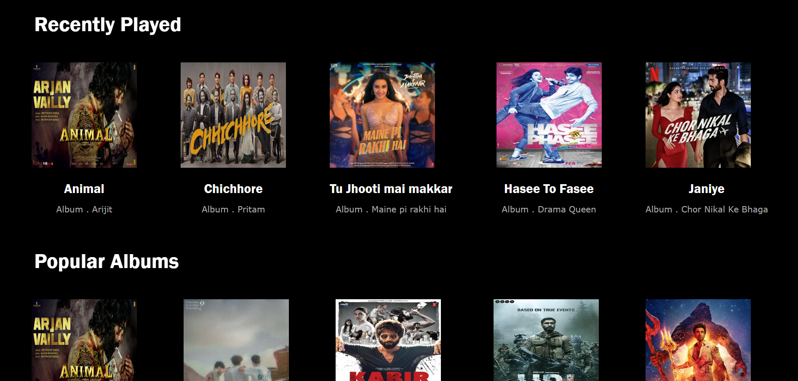
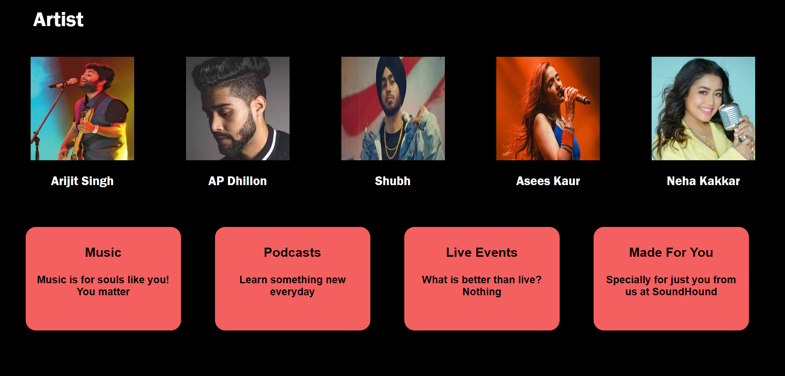
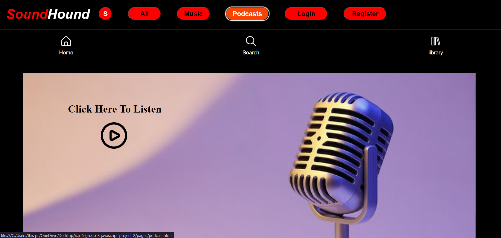

<h1>TITLE :- </h1>
<h3>
SOUNDHOUND is a music website that is designed perfectly for people of all age groups. It is a very simple and easy to use website.
SOUNDHOUND is made for people who love listening songs. Sometimes people may also like to rely on podcasts for inspirational or
educational knowledge. At such times, our website is the perfect thing to depend upon.
</h3>  
<h1>INTRODUCTION :-</h1>
<h3>
One can explore features like music and podcasts in the website. Also there is a huge variety of songs and podcasts available. Users can also save and like their favourite songs and podcasts and can add them in the library. The website also reads your choices and then recommends songs and podcasts accordingly. This makes it a lot easier for the users to save time too.
</h3>  
<h1>FEATURES :-</h1>
<h3>
1)Search bar helps in searching songs and podcasts 
2)Personal Library available 
3)Can like songs 
4)Wide Variety available 
5)Categorization of songs 
6)Easy login and registration 
7)Dark mode for eye protection 
</h3>  
<h1>WEBSITE SNEAK-IN :-</h1>
<h3>Below are some images that show how our website looks like :</h3>
  

  

